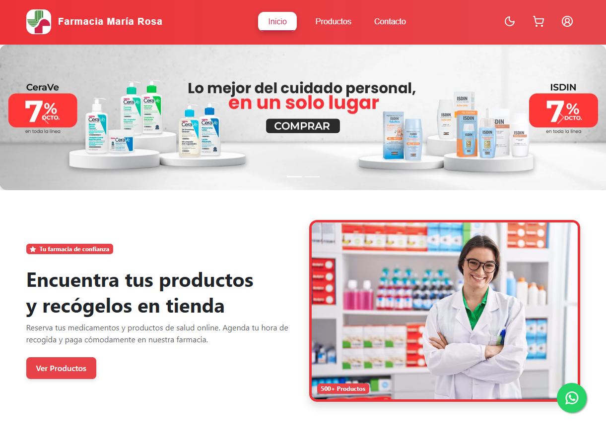
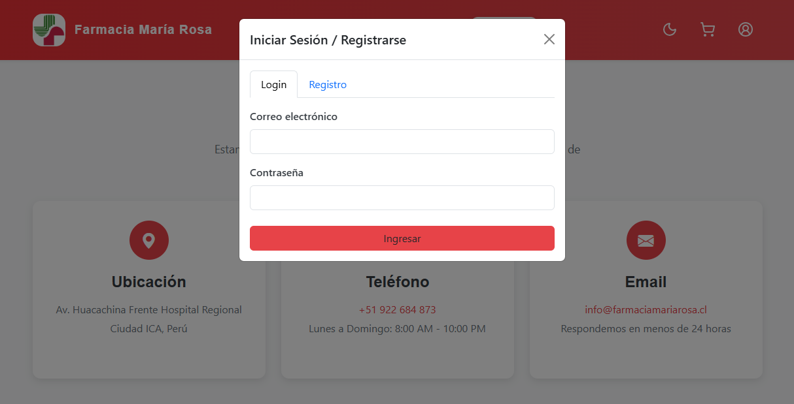
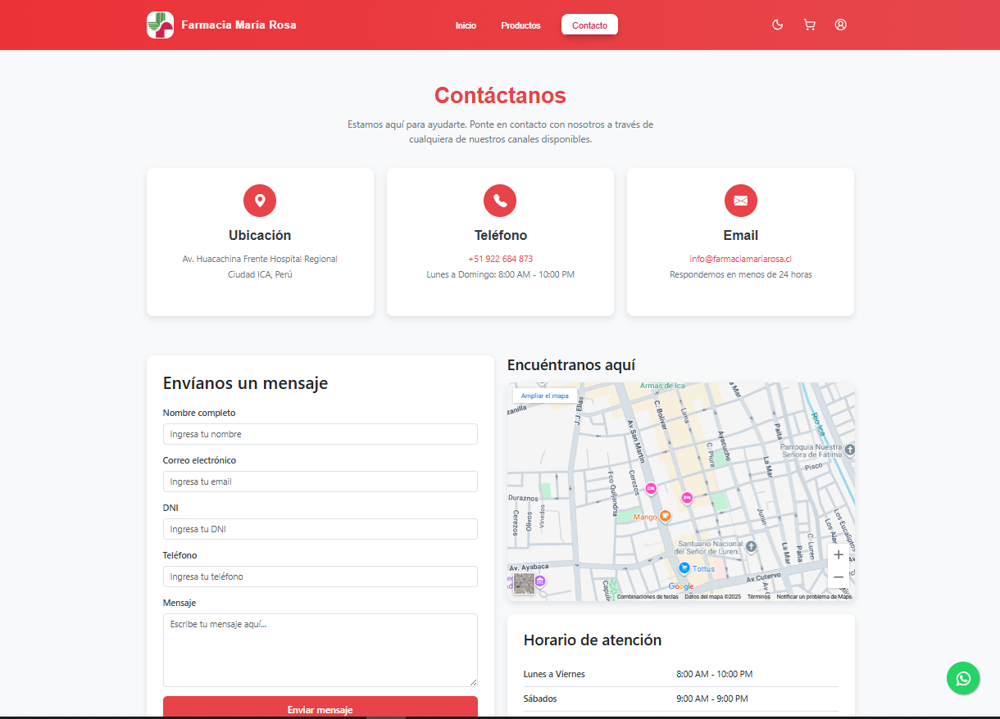
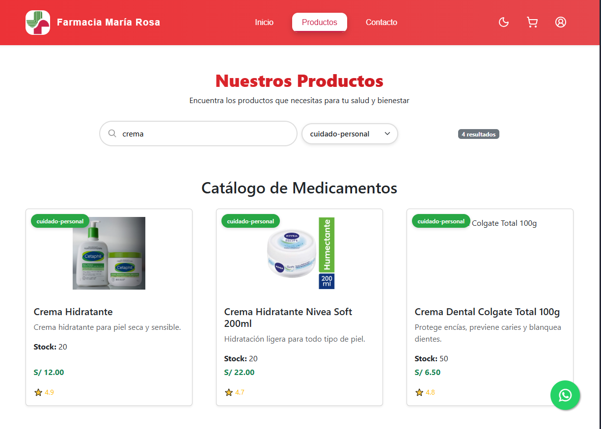
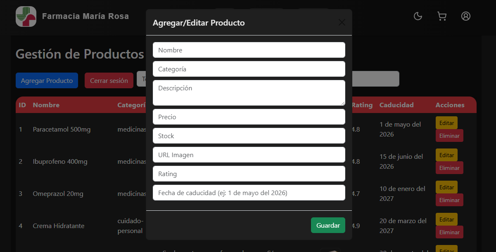
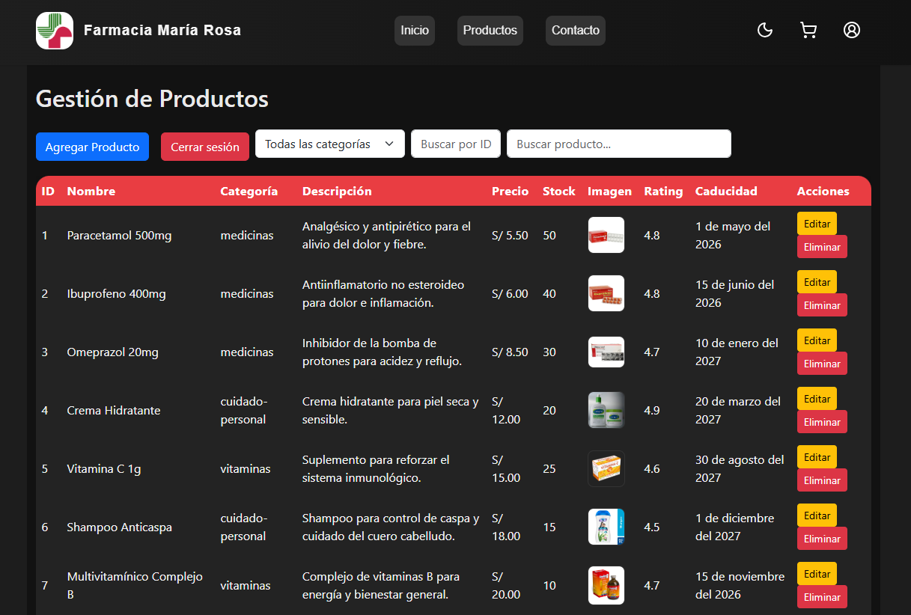

# 💊 Farmacia María Rosa - Sistema Web

[](https://www.java.com/)
[](https://spring.io/projects/spring-boot)
[](https://www.postgresql.org/)
[](https://getbootstrap.com/)
[](LICENSE)

---

## 📌 Descripción
Sistema web para **gestión de farmacia** que permite:  
- 👩‍⚕️ A los clientes: visualizar catálogo de productos, reservar y recoger en tienda.  
- 🧑‍💻 Al administrador: gestionar productos, usuarios y visualizar estadísticas de ventas.  

---

## 🛠️ Tecnologías utilizadas
### Backend
- ☕ **Java 21**
- 🌱 **Spring Boot 3.5.5** (REST + JPA + Thymeleaf)
- 🗄️ **PostgreSQL** como base de datos relacional
- 🐘 Hibernate ORM

### Frontend
- 🌐 **HTML5, CSS3, JavaScript Vanilla**
- 🎨 **Bootstrap 5**
- 🌙 Modo oscuro con JavaScript
- 📊 Dashboard administrativo (ventas, usuarios, productos)

---

## ⚙️ Instalación y configuración

### 1️⃣ Clonar repositorio
```bash
git clone https://github.com/SandroCy6/FarmaciaMariaRosa.git
cd farmacia-maria-rosa
```
### 2️⃣ Base de datos
- Crear una base de datos en PostgreSQL:
```properties
CREATE DATABASE farmacia_maria_rosa;
```
Configurar credenciales en [application.properties](springboot/demo/src/main/resources/application.properties):
```properties
spring.datasource.username=postgres
spring.datasource.password=1234
```
⚠️ Nota: Spring Boot creará automáticamente las tablas gracias a hibernate.ddl-auto=update.

### 3️⃣ Backend
```bash
cd springboot
cd demo
```
# En PowerShell
```bash
.\mvnw.cmd clean spring-boot:run
```

# En CMD
```bash
mvnw.cmd clean spring-boot:run
```

# Si tienes Maven global
```bash
- mvn clean spring-boot:run
```
---
✅ Si todo funciona, verás en consola:
```bash
Tomcat started on port(s): 8081
Started DemoApplication in X seconds
```

### 4️⃣ Frontend
- Abrir el archivo [index.html](frontent/index.html) en la carpeta frontend en tu navegador.
- (Puedes usar Live Server de VSCode para mayor comodidad).

---

## 🚀 Uso

🔑 Login de administrador:
- Email: admin@farmacia.com
- Password: 123456

#### 👤 Usuarios pueden registrarse y acceder a su perfil.

#### 📦 Los productos se muestran en catálogo con filtros y buscador.

#### 🛒 Reservar productos y recogerlos en la farmacia.

# 📸 Capturas de pantalla

## 🏠 Página principal


---

## 🔑 Login


---

## 👤 Contacto


---

## 📦 Catálogo de productos


---

## ⚙️ CRUD de productos


---

## 📊 Panel de administración



## 📂 Estructura del proyecto

### FRONTEND
```bash
📦frontend
 ┣ 📂admin
 ┃ ┗ 📜admin.html
 ┣ 📂assets
 ┃ ┣ 📂css
 ┃ ┃ ┣ 📂modules
 ┃ ┃ ┃ ┣ 📜footer-style.css
 ┃ ┃ ┃ ┣ 📜navbar-style.css
 ┃ ┃ ┃ ┗ 📜whatsapp-style.css
 ┃ ┃ ┣ 📜admin-style.css
 ┃ ┃ ┣ 📜body-style.css
 ┃ ┃ ┣ 📜contacto-styles.css
 ┃ ┃ ┣ 📜index-style.css
 ┃ ┃ ┗ 📜products-style.css
 ┃ ┣ 📂icons
 ┃ ┃ ┣ 📜apps_24dp_E3E3E3_FILL0_wght400_GRAD0_opsz24.svg
 ┃ ┃ ┣ 📜bedtime_24dp_E3E3E3_FILL0_wght400_GRAD0_opsz24.svg
 ┃ ┃ ┣ 📜call_24dp_E3E3E3_FILL0_wght400_GRAD0_opsz24.svg
 ┃ ┃ ┣ 📜chat.svg
 ┃ ┃ ┣ 📜dark-mode-svgrepo-com.svg
 ┃ ┃ ┣ ...
 ┃ ┣ 📂img
 ┃ ┃ ┣ 📜amoxicilina.jpg
 ┃ ┃ ┣ 📜aspirina.png
 ┃ ┃ ┣ 📜banner.webp
 ┃ ┃ ┣ ...
 ┃ ┗ 📂js
 ┃ ┃ ┣ 📜dark-mode.js
 ┃ ┃ ┣ 📜index-products.js
 ┃ ┃ ┣ 📜login.js
 ┃ ┃ ┗ 📜products.js
 ┣ 📂data
 ┃ ┗ 📜products.json
 ┣ 📂pages
 ┃ ┣ 📜contacto.html
 ┃ ┣ 📜login.html
 ┃ ┣ 📜perfil.html
 ┃ ┣ 📜productos.html
 ┃ ┣ 📜register.html
 ┃ ┗ 📜reserva.html
 ┗ 📜index.html
```
### BACKEND
```bash
📦springboot
 ┣ 📂.vscode
 ┃ ┗ 📜settings.json
 ┗ 📂demo
 ┃ ┣ 📂.mvn
 ┃ ┃ ┗ 📂wrapper
 ┃ ┃ ┃ ┗ 📜maven-wrapper.properties
 ┃ ┣ 📂src
 ┃ ┃ ┣ 📂main
 ┃ ┃ ┃ ┣ 📂java
 ┃ ┃ ┃ ┃ ┗ 📂com
 ┃ ┃ ┃ ┃ ┃ ┗ 📂proyectouno
 ┃ ┃ ┃ ┃ ┃ ┃ ┗ 📂demo
 ┃ ┃ ┃ ┃ ┃ ┃ ┃ ┣ 📂Config
 ┃ ┃ ┃ ┃ ┃ ┃ ┃ ┃ ┗ 📜Config.java
 ┃ ┃ ┃ ┃ ┃ ┃ ┃ ┣ 📂Controller
 ┃ ┃ ┃ ┃ ┃ ┃ ┃ ┃ ┗ 📜ContactoController.java
 ┃ ┃ ┃ ┃ ┃ ┃ ┃ ┣ 📂DTO
 ┃ ┃ ┃ ┃ ┃ ┃ ┃ ┃ ┣ 📜CategoriaDTO.java
 ┃ ┃ ┃ ┃ ┃ ┃ ┃ ┃ ┣ 📜ClienteDetalleDTO.java
 ┃ ┃ ┃ ┃ ┃ ┃ ┃ ┃ ┣ 📜ClienteResumenDTO.java
 ┃ ┃ ┃ ┃ ┃ ┃ ┃ ┃ ┣ 📜DetallePedidoDTO.java
 ┃ ┃ ┃ ┃ ┃ ┃ ┃ ┃ ┣ 📜MensajeContactoDTO.java
 ┃ ┃ ┃ ┃ ┃ ┃ ┃ ┃ ┣ 📜PedidoDetalleDTO.java
 ┃ ┃ ┃ ┃ ┃ ┃ ┃ ┃ ┣ 📜PedidoResumenDTO.java
 ┃ ┃ ┃ ┃ ┃ ┃ ┃ ┃ ┣ 📜ProductoDetalleDTO.java
 ┃ ┃ ┃ ┃ ┃ ┃ ┃ ┃ ┗ 📜ProductoResumenDTO.java
 ┃ ┃ ┃ ┃ ┃ ┃ ┃ ┣ 📂models
 ┃ ┃ ┃ ┃ ┃ ┃ ┃ ┃ ┣ 📜Categoria.java
 ┃ ┃ ┃ ┃ ┃ ┃ ┃ ┃ ┣ 📜Cliente.java
 ┃ ┃ ┃ ┃ ┃ ┃ ┃ ┃ ┣ 📜DetallePedido.java
 ┃ ┃ ┃ ┃ ┃ ┃ ┃ ┃ ┣ 📜MensajeContacto.java
 ┃ ┃ ┃ ┃ ┃ ┃ ┃ ┃ ┣ 📜Pedido.java
 ┃ ┃ ┃ ┃ ┃ ┃ ┃ ┃ ┗ 📜Producto.java
 ┃ ┃ ┃ ┃ ┃ ┃ ┃ ┣ 📂repository
 ┃ ┃ ┃ ┃ ┃ ┃ ┃ ┃ ┣ 📜ClienteRepository.java
 ┃ ┃ ┃ ┃ ┃ ┃ ┃ ┃ ┗ 📜MensajeContactoRepository.java
 ┃ ┃ ┃ ┃ ┃ ┃ ┃ ┣ 📜DemoApplication.java
 ┃ ┃ ┃ ┃ ┃ ┃ ┃ ┗ 📜HelloController.java
 ┃ ┃ ┃ ┗ 📂resources
 ┃ ┃ ┃ ┃ ┣ 📂templates
 ┃ ┃ ┃ ┃ ┃ ┗ 📜index.html
 ┃ ┃ ┃ ┃ ┗ 📜application.properties
 ┃ ┃ ┗ 📂test
 ┃ ┃ ┃ ┗ 📂java
 ┃ ┃ ┃ ┃ ┗ 📂com
 ┃ ┃ ┃ ┃ ┃ ┗ 📂proyectouno
 ┃ ┃ ┃ ┃ ┃ ┃ ┗ 📂demo
 ┃ ┃ ┃ ┃ ┃ ┃ ┃ ┗ 📜DemoApplicationTests.java
 ┃ ┃ ┃ ┣ 📂templates
 ┃ ┃ ┃ ┃ ┗ 📜index.html
 ┃ ┃ ┃ ┗ 📜application.properties
 ┃ ┃ ┗ 📂test-classes
 ┃ ┃ ┃ ┗ 📂com
 ┃ ┃ ┃ ┃ ┗ 📂proyectouno
 ┃ ┃ ┃ ┃ ┃ ┗ 📂demo
 ┃ ┃ ┃ ┃ ┃ ┃ ┗ 📜DemoApplicationTests.class
 ┃ ┣ 📜.gitattributes
 ┃ ┣ 📜.gitignore
 ┃ ┣ 📜mvnw
 ┃ ┣ 📜mvnw.cmd
 ┃ ┗ 📜pom.xml
```
---

## 📌 Notas finales
- Este proyecto está en desarrollo 🚧, puede cambiar con el tiempo.
- Si tienes sugerencias o encuentras errores, ¡no dudes en contribuir! 🤝
- Autor: ****
---
